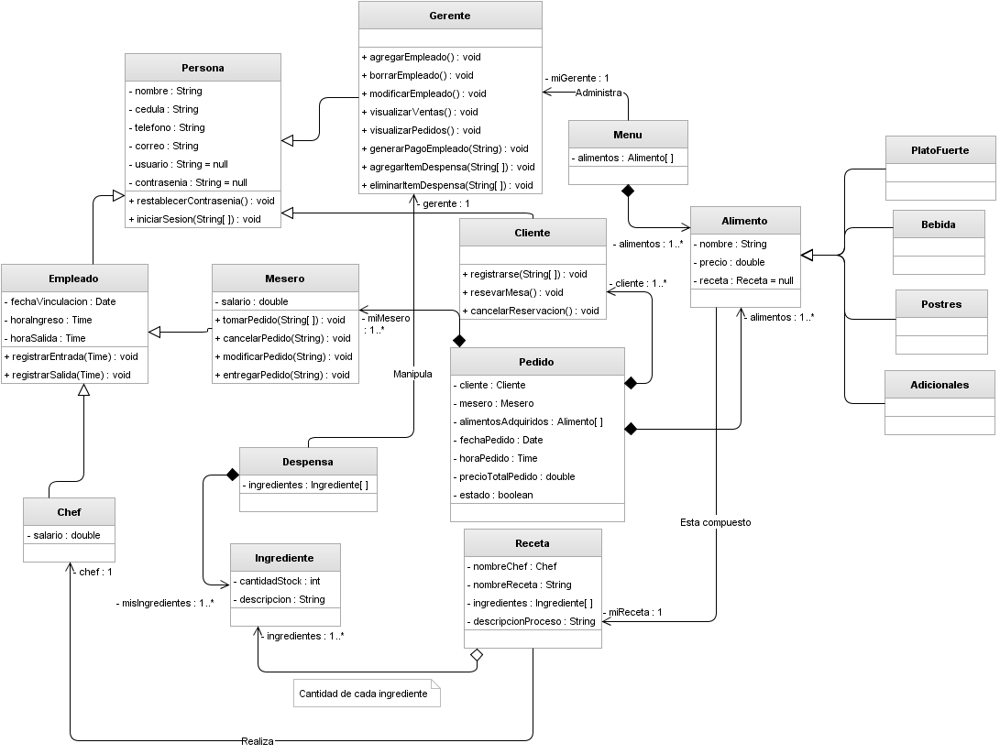

# Restorante - Sistema de Gestión Gastronómica

¡Bienvenido/a! Este proyecto es el **Proyecto Final Integrador**, de la materia Programación Orientada a Objetos de la Técnicatura Universitaria en Desarrollo de Software del Insituto Tecnológico Universitario de Mendoza. 

Un sistema completo para la gestión de un restaurante. La aplicación sigue una arquitectura robusta en el backend para administrar platos, ingredientes y stock, sirviendo una interfaz web dinámica y fluida.

---

## 🛠️ Stack Tecnológico

El proyecto está construido utilizando las siguientes tecnologías:

* **Backend:** Java 21 con **Spring Boot 4.0.6**
* **Gestor de Dependencias:** Gradle
* **Base de Datos:** MySQL
* **Persistencia:** Spring Data JPA / Hibernate
* **Frontend:** HTML5, CSS3 y JavaScript Vanilla (sirviendo contenido estático)
* **Plantillas (Opcional/Soporte):** Thymeleaf
* **Herramientas adicionales:** Spring RestDocs (para documentación de API).

---

## 📐 Diseño y Arquitectura

### Arquitectura de Software
El backend se desarrolló bajo el patrón **MVC (Modelo-Vista-Controlador)**, garantizando una separación limpia de responsabilidades en las siguientes capas:
* **Entity:** Modelado de las tablas de la base de datos.
* **Repository:** Capa de acceso a datos (JPA).
* **Service:** Lógica de negocio y reglas del restaurante.
* **Controller:** Exposición de los endpoints REST para el consumo del frontend.

### Diagrama de Clases
*A continuación se presenta el modelo de dominio utilizado para la consistencia de los datos:*



```
Persona
└── Empleado
├── Chef       
└── Mesero     
└── Gerente        
└── Cliente        
```
```
Alimento
├── PlatoFuerte    
├── Postres        
├── Bebida         
└── Adicionales    
```
---

## 🔌 Endpoints Principales (API REST)

La API expone los siguientes recursos base para interactuar con el sistema:

| Recurso | Endpoint | Descripción |
| :--- | :--- | :--- |
| **Menú** | `/api/menu` | Gestión de la carta, platos disponibles y precios. |
| **Alimentos** | `/api/alimentos` | Administración de los platos preparados o listos para servir. |
| **Ingredientes** | `/api/ingredientes` | Detalle de los componentes individuales de cada plato. |
| **Despensa** | `/api/despensa` | Control de stock, inventario y materias primas disponibles. |

---

## 🚀 Instalación y Configuración

Siga estos pasos para clonar y ejecutar el proyecto localmente:

### Requisitos Previos
* **Java JDK 21** instalado.
* **MySQL Server** corriendo localmente.
* Un gestor de bases de datos (ej. MySQL Workbench, DBeaver).

### Configurar la Base de Datos
Abra su gestor de MySQL y cree una base de datos vacía llamada `proyectorestorante`:
   ```sql
   CREATE DATABASE proyectorestorante 
          CHARACTER SET utf8mb4 
          COLLATE utf8mb4_unicode_ci; 
   ```

### Configurar las Credenciales
El proyecto está configurado por defecto en el archivo src/main/resources/application.properties:
```
Properties
spring.application.name=restorante-springboot

spring.datasource.url=jdbc:mysql://localhost:3306/proyectorestorante?serverTimeZone=UTC
spring.datasource.username= TU_USUARIO_AQUÍ
spring.datasource.password=TU_CONTRASEÑA_AQUÍ

spring.jpa.show-sql=true
spring.jpa.hibernate.ddl-auto=update
```
⚠️ Nota: Si tu usuario de MySQL tiene contraseña, recordá colocarla en la propiedad spring.datasource.password. Al iniciar, Hibernate creará las tablas automáticamente (ddl-auto=update).

### Ejecutar la Aplicación

Al ser un frontend estático integrado, el backend se encarga de servir los archivos de la interfaz desde la ruta src/main/resources/static.

* Desde tu IDE (IntelliJ IDEA / Eclipse): Ejecuta la clase principal RestoranteSpringbootApplication.java.

* Opción recomendada: Desde la terminal usando Gradle Wrapper:
```
Bash
./gradlew bootRun
```

Descargará toda las dependencias necesarias para ejecutar el proyecto.

### Una vez que el servidor inicie, abre tu navegador web e ingresa a:

```
👉 http://localhost:8080/
 
 Se te redigira por defecto a la pantalla principal de la aplicación
 http://localhost:8080/menu
```

